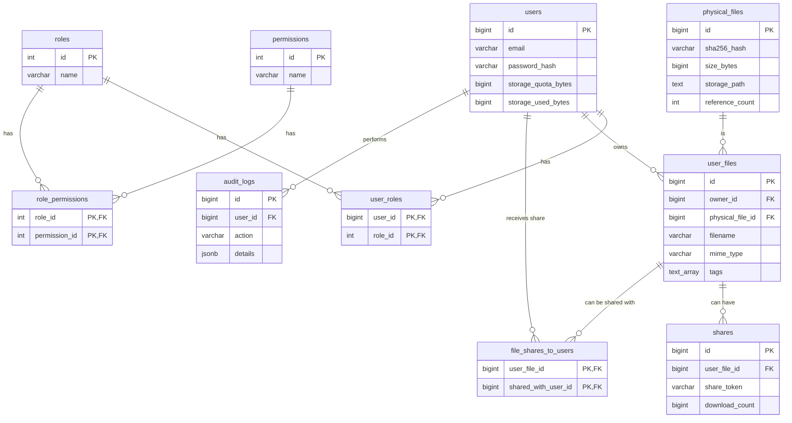

# Database Schema Overview

This document provides an overview of the PostgreSQL database schema for the File Vault application.

## Entity-Relationship Diagram (ERD)

```mermaid
erDiagram
    users {
        bigint id PK
        varchar email
        varchar password_hash
        bigint storage_quota_bytes
        bigint storage_used_bytes
    }
    roles {
        int id PK
        varchar name
    }
    permissions {
        int id PK
        varchar name
    }
    user_roles {
        bigint user_id PK, FK
        int role_id PK, FK
    }
    role_permissions {
        int role_id PK, FK
        int permission_id PK, FK
    }
    physical_files {
        bigint id PK
        varchar sha256_hash
        bigint size_bytes
        text storage_path
        int reference_count
    }
    user_files {
        bigint id PK
        bigint owner_id FK
        bigint physical_file_id FK
        varchar filename
        varchar mime_type
        text_array tags
    }
    shares {
        bigint id PK
        bigint user_file_id FK
        varchar share_token
        bigint download_count
    }
    file_shares_to_users {
        bigint user_file_id PK, FK
        bigint shared_with_user_id PK, FK
    }
    audit_logs {
        bigint id PK
        bigint user_id FK
        varchar action
        jsonb details
    }

    users ||--o{ user_roles : "has"
    roles ||--o{ user_roles : "has"
    roles ||--o{ role_permissions : "has"
    permissions ||--o{ role_permissions : "has"
    users ||--o{ user_files : "owns"
    physical_files ||--o{ user_files : "is"
    user_files ||--o{ shares : "can have"
    user_files ||--o{ file_shares_to_users : "can be shared with"
    users ||--o{ file_shares_to_users : "receives share"
    users ||--o{ audit_logs : "performs"
```